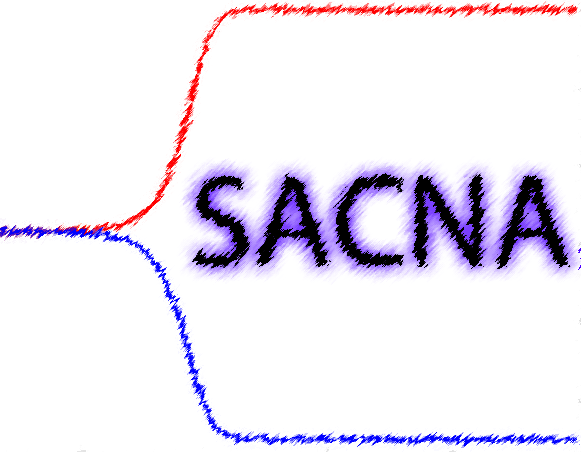

# SACNA (Semi-Algebraic Chemical Network Analyzer)

SACNA is a Mathematica Package developed by Daniel Fula and J. Montoya in order to detect the chemical reaction networks that exhibit chiral
amplificators using the Collins' algorithm. The package provides 2 ways of analysis and a simulator.

## Requirements

* Mathematica 12

## How to use it
Some Mathematica notebooks (and their corresnponding PDFs) with explanations of the package usage can be found in the Tutorial folder.

## LICENSE
This code is released under Apache 2.0
